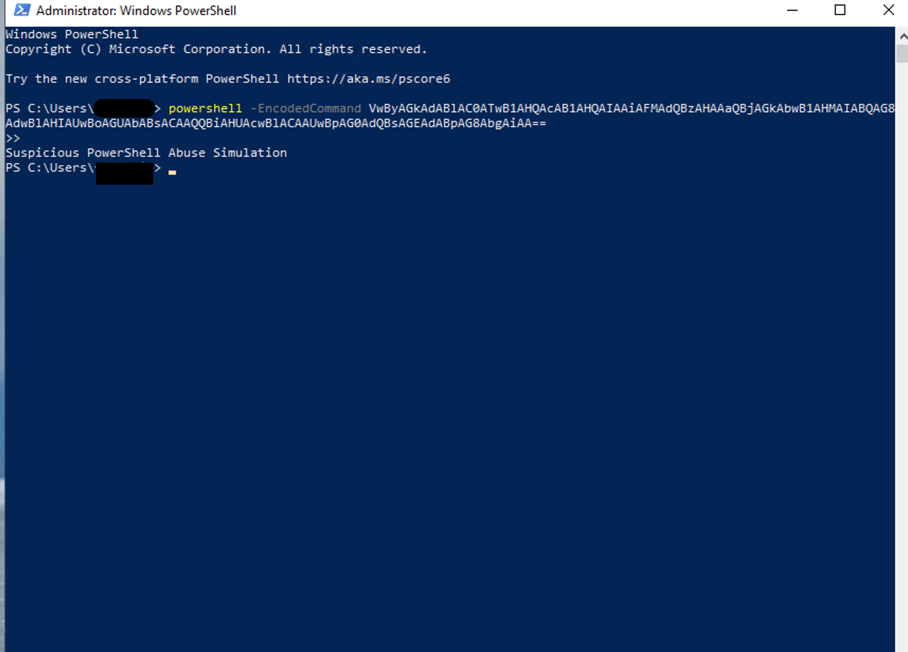
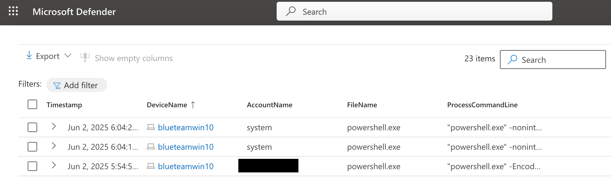
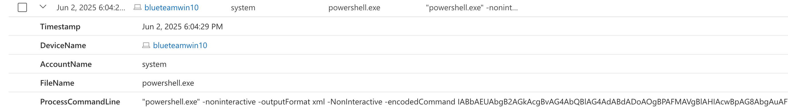
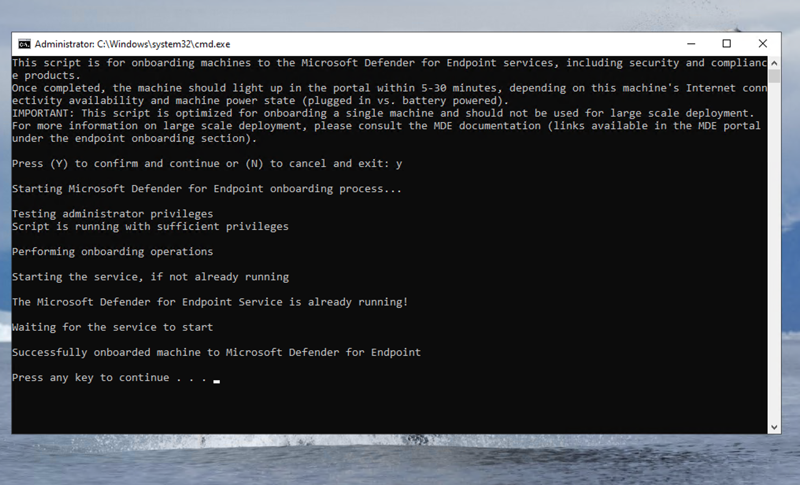

# 🧪 PowerShell Encoded Command Threat Hunting Lab

## 📌 Overview

This lab simulates an attacker using an encoded PowerShell command (`-EncodedCommand`) to execute a potentially malicious payload. Using Microsoft Defender for Endpoint and KQL, I simulated the attack and hunted for the encoded command activity within Defender logs. This lab walks through simulation, detection, and basic remediation logic.

---

## ⚙️ Event Creation

### 🎭 Threat Simulation

A harmless PowerShell command was encoded in Base64 and executed using the `-EncodedCommand` flag to simulate obfuscated attacker behavior. This is a common evasion tactic in real-world attacks.

#### 💻 Command Used:
```powershell
powershell -EncodedCommand VwByAGkAdABlAC0ATwB1AHQAcAB1AHQAIAAiAFMAdQBzAHAAaQBjAGkAbwB1AHMAIABQAG8AdwBlAHIAUwBoAGUAbABsACAAQQBiAHUAcwBlACAAUwBpAG0AdQBsAGEAdABpAG8AbgAiAA==
```

This command decodes to:
```powershell
Write-Output "Suspicious PowerShell Abuse Simulation"
```

---

## 🔍 Detection via KQL

### 🧠 Query Used:
```kql
DeviceProcessEvents
| where Timestamp > ago(2h)
| where FileName endswith "powershell.exe"
| where ProcessCommandLine has "-EncodedCommand"
| project Timestamp, DeviceName, AccountName, FileName, ProcessCommandLine
| order by Timestamp desc
```

📎 [Download the query as a `.kql` file](powershell_encoded_command_query_v2.kql)

---

### 🖼️ Screenshots
- 
- 
- 
- 

---

## 🧩 Device Onboarding

The virtual machine was onboarded to Microsoft Defender using a custom script provided by the lab environment. This step ensured logging of PowerShell activity in Defender for advanced hunting.

🖥️ 

---

## 🛡️ Remediation (Simulated)

If this were a real attack, these steps would follow detection:

- 🔍 Review full process tree and timeline
- 🕵🏽 Investigate parent and child processes
- 🚫 Isolate the endpoint if malicious behavior is confirmed
- ❌ Terminate the suspicious process
- 📦 Quarantine downloaded files
- 🚨 Escalate per incident response procedures

---

## 🧰 Tools Used

- Microsoft Defender for Endpoint  
- Microsoft Defender Advanced Hunting  
- PowerShell  
- KQL (Kusto Query Language)

---

## ✅ Outcome

Successfully simulated and detected the use of an obfuscated PowerShell command. Demonstrated real-world detection, triage, and basic response logic using Microsoft Defender and KQL.

